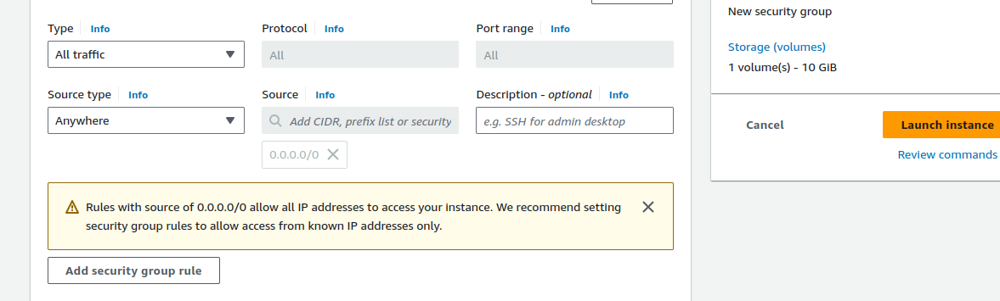

# DockerWorkbook

https://docs.docker.com/get-started/overview/


    CONTAINERIZATION - TECHNOLOGY
    DOCKER - PLATFORM

why docker ?


### DOCKER  - SOFTWARE VIRTUALIZATION
 - is an open source platform to develop,ship,run applications anywhere
 

 - ability to package and run applications in isolated environment called containers

### containers 
    => runnable instance of an image ( application packaged with dependency)

### how to create a docker image:
    - Dockerfile - contains set of instructions which the docker engine will run to create an image


registry 
- eg public docker hub from docker / azure container registry / private registry
- place where docker images are stored

public registry ( default ) - https://hub.docker.com/
where docker daemon - searches to get image at first


practise:

- create a EC2 instance - Linux AMI, t2.micro, 8gb HDD
- create a keypair - RSA, 
- new Security group with all traffic allowed in inboud rule
- install docker as userdata to action at vm provisioning time ( in azure - custom data // in Aws - userdata)


```
#!/bin/bash
yum -y update
yum -y install docker
systemctl start docker
systemctl enable docker

```

hands on




### login to EC2 instance,

docker --version ( to check the installed version )

docker version ( to check client and server version )

if any access issue - 
switch to root user -> ```sudo -i```

or add the user to Docker group
``` sudo usermod -aG docker ubuntu  ```

to see if docker daemon is working 


to check if any container is running
``` docker ps```

to check list of all container ( whether running / stopped)
``` docker ps -a```

to delete a container
docker container rm containerid

to list all images
```docker images```

to delete the image
```docker image rm imageid```

to pull a new image
```docker pull centos:7```


image size - 204 MB
if vm - 4 GB


To run a container and login to it - must to use options / flags:

    -i => interactive
    -t => terminal

#image with default run command

``` docker container run -i -t centos:7 bash```

to start the exited container

```docker container start CONTAINERID```

if suppose any container is running in detached mode, and we want to get in

```docker container attach CONTAINERID```

if we use exit to get out of a container, the container will be stopped after exiting, so to get out while leaving the container, can use 
    
    ```ctrl p+q```


if we want to run a container in detached mode

    ```docker container run -i -t -d centos:7 bash```


### alpine - linux lightweight image

docker container run -i -t alpine

and install git using package manager ( apk update, apk add git)


to create a new image, from the current state of the running container

    ```docker commit CONTAINERID userid/imagename:tag```


# To upload the image to docker hub, login and push
`docker login`
docker push nameoftheimage:tag


 
 

 

 # run a nginx webserver with port mapping

    localport<->container port
    
 ```docker container -d -p 9090:80 nginx```

 

 


 # other commands
  

   - copy a file from local to container

  `docker container cp abc.txt CONTAINERID:pathtopaste`


 - copy a file from container to local

 `docker cp container1:/app/example.txt .`

 


# create a simple docker file => alpine with git installed

 Dockerile - is a simple text file, with instructions to create a  image

 Capital D'

 - first instruction is FROM <baseimage>

 like FROM alpine:1.21.1

- RUN command to run a instruction


to create a image from the dockerfile, need to BUILD

`docker image build -t NAMEOFTHEIMAGE:TAG pathofthedockerfile`


 - custom Dockerfile naming

               docker image build -t thulasi-alpine:v2 -f newDockerfile .(path to the dockerfile)


     - ENTRY POINT :` DEFAULT INSTRUCTION COMMAND`


----------

# CONTAINER STORAGE IS NON-PERSISTENT !!!

### how to make container storage persistent

    => Docker Volumes

check if any docker volume


Create docker volume

docker volume create VOLUMENAME


create a container mounting our volume


    `docker container run -i -t --mount source=myvol1,target=/thulasi centos:7 bash`


- enter the container
- create a file under /thulasi
- exit the container
-delete the container

But, the created file will be there in the volume mounted.

where -? in the default directory of the docker `/var/lib/docker/volumes/myvol1/_data`

